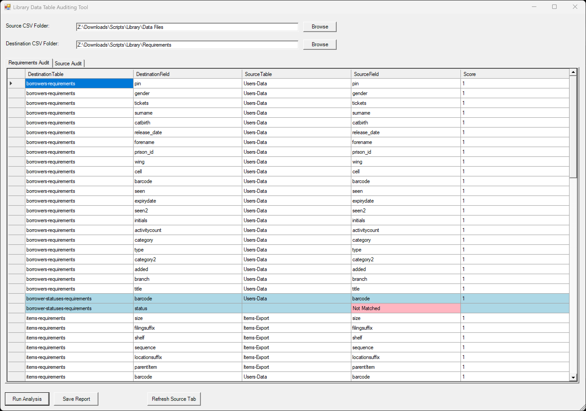
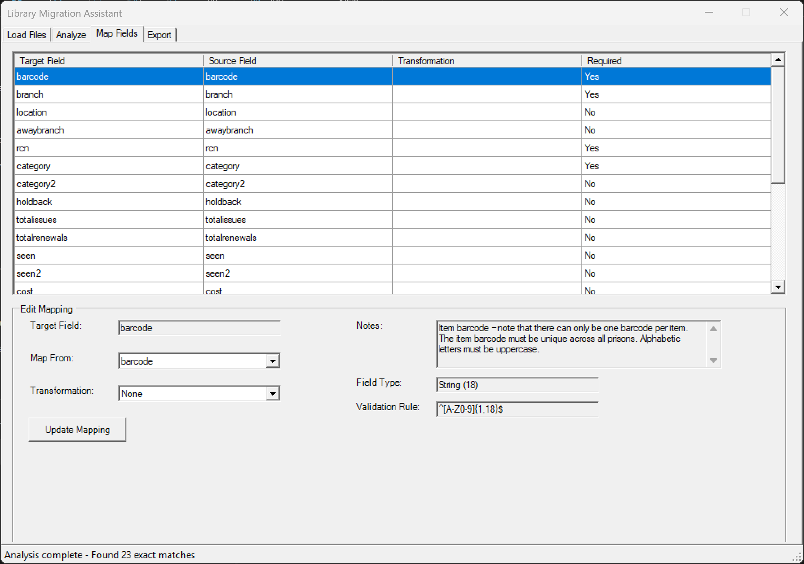
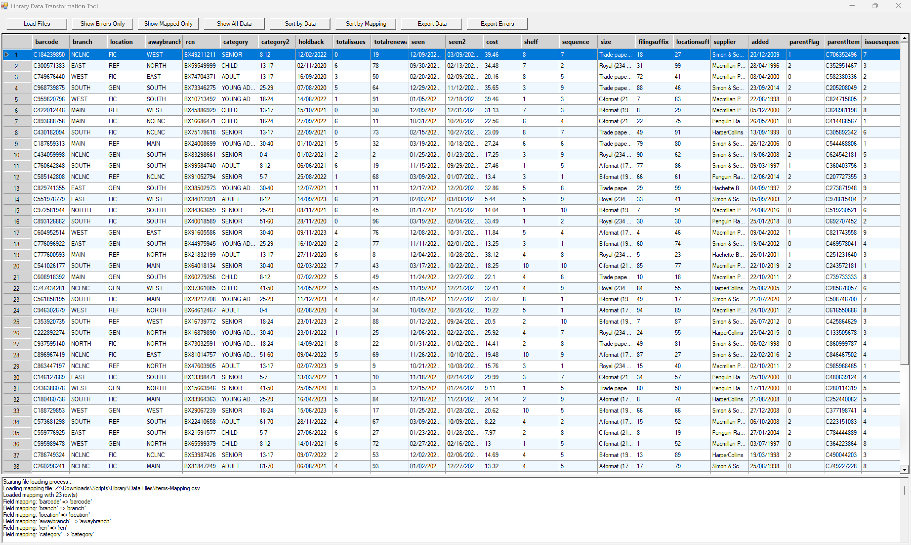
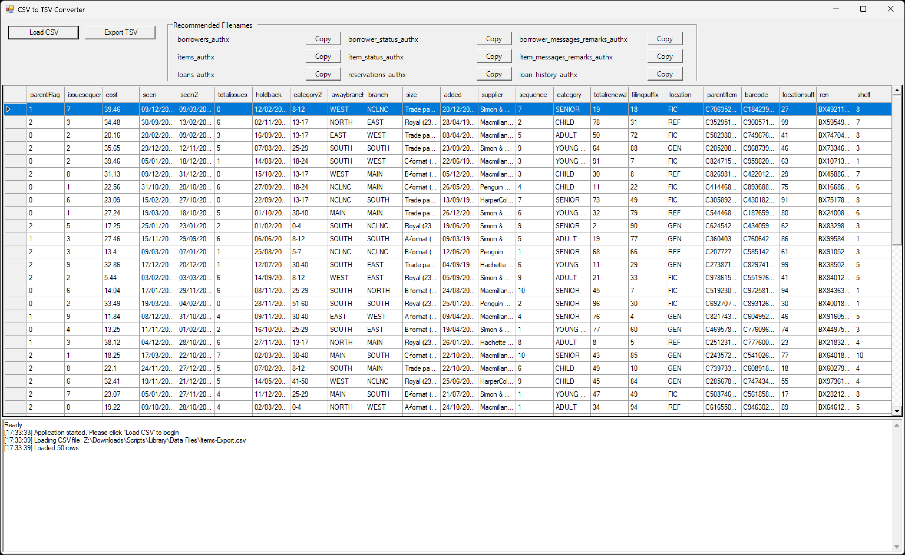

# Library Migration Toolset

A comprehensive PowerShell toolkit for library system migrations, helping librarians and system administrators map fields between different library management systems, transform data during migration, and ensure compatibility with target systems.

## Overview

This repository contains four essential PowerShell GUI tools designed to help library staff migrate data between different library management systems:

1. **Library-Compare.PS1 (Library Data Table Auditing Tool)** - Compare source and destination database tables and determine migration paths
2. **Library-Analyse.PS1 (Library Analysis Tool)** - A field mapping tool for planning data migrations between source and target systems
3. **Library-Process.PS1 (Library Data Transformation Tool)** - Process, validate, and transform data according to mapping rules and business requirements
4. **CSVtoTSV-Converter** - Convert standard CSV files to required "field=value" format

These tools work together to simplify the complex process of migrating from one library system to another while ensuring data integrity and consistency throughout the migration process.

## Features

### Library-Compare.PS1



- **Source and Destination Selection**: Browse and load CSV folders from source and target systems
- **Requirements Audit**: Analyze destination fields and find potential matches in source tables
- **Source Audit**: Identify source fields that don't have a clear destination match
- **Intelligent Field Matching**: Uses fuzzy matching algorithm to suggest field mappings based on names
- **Visual Grouping**: Color-coded display of tables for easier comparison
- **Known Matches Support**: Manually define field mappings that may not be automatically detected
- **Export Reports**: Save audit results for further analysis and planning

Key capabilities:
- Levenshtein distance algorithm for fuzzy field matching
- Configurable matching threshold
- Support for multiple CSV tables in both source and destination systems
- Tabbed interface for analyzing both required fields and unmapped source fields
- Visual highlighting of problem areas (unmatched required fields)
- Export capabilities for sharing audit results

### Library-Analyse.PS1



- **Load Files Tab**: Import source data (CSV/Excel) and target field requirements
- **Analyze Tab**: Review source and target fields with data preview and compatibility analysis
- **Map Fields Tab**: Create field mappings with transformation options and validation rules
- **Export Tab**: Generate mapping files with complete configuration options

Key capabilities:
- Automatic field mapping suggestions based on intelligent analysis
- Custom text transformations with live preview
- Field validation rules using regular expressions
- Export to CSV or PowerShell script format for automation
- Support for complex data type conversions

### Library-Process.PS1



- Process data according to mapping rules defined in the Migration Assistant
- Apply transformations to standardize data across systems
- Validate data against business rules and requirements
- Highlight errors for easy identification with detailed error reporting
- Filter and sort data by various criteria (errors only, mapped fields only)
- Toggle between original and mapped field orders
- Export processed data ready for import and detailed error logs

### CSVtoTSV-Converter



- Convert standard CSV files to TSV "field=value" tab-delimited format
- Built-in naming convention guide for target-compatible files
- Skip blank fields automatically
- Convenient file naming templates with copy buttons

## Recommended Migration Workflow

For best results, follow this recommended workflow:

1. **Compare Tables (Library-Compare.PS1)**
   - Load source and destination CSV files
   - Analyze field matches between systems
   - Identify potential mapping issues
   - Export audit reports for planning

2. **Define Field Mappings (Library-Analyse.PS1)**
   - Create detailed field mappings based on Compare results
   - Define transformations and validation rules
   - Generate mapping configuration files

3. **Transform Data (Library-Process.PS1)**
   - Apply mapping rules to transform source data
   - Validate and review transformed data
   - Identify and correct data quality issues

4. **Convert to Target Format (CSVtoTSV-Converter)**
   - Convert processed data to target system format
   - Apply proper naming conventions
   - Prepare final files for import

## Requirements

- Windows OS with PowerShell 5.1 or higher
- .NET Framework 4.5 or higher
- For Excel file support: PowerShell ImportExcel module (optional)

## Installation

1. Clone or download this repository
2. Ensure PowerShell execution policy allows script execution
3. Run the scripts directly from PowerShell or create shortcuts for easier access

```powershell
# Clone the repository
git clone https://github.com/yourusername/library-migration-assistant.git

# Navigate to the directory
cd library-migration-assistant

# Run the comparison tool
.\Library-Compare.PS1

# Run the migration assistant
.\Library-Analyse.PS1

# Run the transformation tool
.\Library-Process.PS1

# Run the TSV converter
.\CSVtoTSV-Converter.PS1
```

No additional PowerShell modules are required by default, but the ImportExcel module will be suggested for Excel file imports if needed.

## Usage Guide

### Library-Compare

1. **Select Source and Destination Folders**
   - Browse for your source CSV folder containing tables from the current system
   - Browse for your destination CSV folder containing target system field requirements
   - Click "Run Analysis" to compare tables and fields

2. **Review Requirements Audit**
   - Review destination fields and potential source field matches
   - Color-coded by table for easier comparison
   - Pink highlights indicate unmatched required fields
   - Score column shows confidence level of matches

3. **Review Source Audit**
   - Check which source fields don't have a corresponding destination
   - Identify potential data loss or fields requiring special handling
   - Color-coded by source table

4. **Save Report**
   - Export the audit results for documentation and planning
   - Use these reports to guide the mapping process in Library-Analyse

### Library-Analyse

1. **Load Files Tab**
   - Browse for your source data CSV/Excel file containing actual library data
   - Browse for your target requirements CSV file describing the destination system fields
   - Click "Load Data" to analyze the files

2. **Analyze Tab**
   - Review source and target fields
   - View data samples to understand field contents
   - Click "Analyze and Generate Mapping Suggestions" to get intelligent mapping recommendations

3. **Map Fields Tab**
   - Review and edit the suggested mappings
   - Select source fields to map to target fields
   - Apply transformations where needed (e.g., format changes, data normalization)
   - Update mappings as needed

4. **Export Tab**
   - Preview the mapping configuration
   - Choose export format (CSV or PowerShell script)
   - Include validation rules and transformations as needed
   - Export the mapping file for use with the Data Transformation Tool

### Library-Process

1. **Load Files**
   - Load the mapping file created with the Migration Assistant
   - Load the source data CSV to be transformed

2. **Data Exploration**
   - View the data with error highlighting
   - Toggle between original and mapped fields
   - Show only records with errors or only mapped fields

3. **Data Transformation**
   - Data is transformed according to mapping rules
   - Error cells are highlighted in pink
   - Review the log for details on transformations and errors

4. **Export**
   - Export the transformed data ready for import into the new system
   - Export error logs for further analysis and cleanup

### CSVtoTSV-Converter

1. **Load CSV**
   - Load your processed data CSV file

2. **Export to Target Format**
   - Convert data to TSV "field=value" tab-delimited format
   - Use the built-in naming convention guide
   - Export files following target's naming requirements

### File Naming Conventions

When exporting files for target systems, follow these naming conventions, where `x` represents your authority number:

- `borrowers_authx` *
- `borrower_status_authx`
- `borrower_messages_remarks_authx`
- `items_authx` *
- `item_status_authx`
- `item_messages_remarks_authx`
- `loans_authx` *
- `reservations_authx`
- `loan_history_authx`

Files marked with * are mandatory.

## Transformation Functions

The system uses a collection of transformation functions to modify data during migration. These functions are defined in the `Transform-Functions.ps1` file.

### Built-in Transformations

```powershell
# Gender detection based on title
function GenderTransform($value) {
    if ($value -match "\b(Mrs|Miss|Ms)\b") {
        return "Female"
    }
    elseif ($value -match "\bMr\b") {
        return "Male"
    }
    else {
        return ""
    }
}

# Borrower type detection based on ID pattern
function BorrowerTypeTransform($value) {
    if ($value -match "^[A-Za-z][0-9]{4}[A-Za-z]{2}$") {
        return "Student"
    }
    else {
        return "Teacher"
    }
}
```

### Creating Custom Transformations

You can create and add custom transformation functions directly within the Migration Assistant UI or by editing the `Transform-Functions.ps1` file.

Each function should:
1. Accept a single input value
2. Return the transformed value
3. Be registered in the `$global:TransformFunctions` hashtable

Example custom function for ISBN formatting:

```powershell
function FormatISBN($value) {
    # Remove all non-numeric characters
    $cleanISBN = $value -replace "[^0-9X]", ""
    
    # Check if valid ISBN-10 or ISBN-13
    if ($cleanISBN.Length -eq 10 -or $cleanISBN.Length -eq 13) {
        return $cleanISBN
    }
    else {
        return $value  # Return original if not valid
    }
}
$global:TransformFunctions["FormatISBN"] = ${function:FormatISBN}
```

## Requirements

- Windows with PowerShell 5.1 or higher
- .NET Framework 4.5 or higher
- Recommended: 4GB RAM for processing large datasets

## File Formats

### Target System Requirements File Format

The target requirements CSV file should contain the following columns:

- **FieldName**: The name of the field in the target system
- **FieldType**: Data type (string, numeric, date, etc.)
- **Mandatory**: Whether the field is required ("Yes" or "No")
- **ValidationRule**: Regular expression or rule for validation
- **Notes**: Additional information about the field

Example:

```csv
FieldName,FieldType,Mandatory,ValidationRule,Notes
PatronID,string,Yes,^[A-Z][0-9]{6}$,Must start with letter followed by 6 digits
FirstName,string,Yes,,
LastName,string,Yes,,
BorrowerType,string,Yes,^(Student|Teacher|Staff)$,Must be one of the allowed values
EmailAddress,string,No,^[\w.%+-]+@[\w.-]+\.[a-zA-Z]{2,}$,Must be valid email format
```

### Field Mapping File Format

The mapping file (created by the Migration Assistant) defines how fields are mapped and transformed:

- **SourceField**: Field name from the source system
- **NewField**: Field name in the target system
- **DataType**: Expected data type
- **Mandatory**: Whether the field is required
- **Validation**: Whether validation is enabled
- **ValidationRule**: Rule to check data against
- **Transformation**: Whether transformation is enabled
- **TransformFunction**: Name of the function to apply
- **Required**: Whether the field is required in the target system

### Known Matches File Format

The Known-Matches.csv file (used by Library-Compare) helps define mappings that may not be automatically detected:

- **Requirement**: Field name from the destination system
- **Known-Fields**: Comma-separated list of source field names that map to this requirement

Example:

```csv
Requirement,Known-Fields
PatronID,BorrowerNumber,UserID
EmailAddress,Email,UserEmail,ContactEmail
```
